# Introdução

Informações básicas do projeto.

* **Projeto:** PRONCOVÔ
* **Repositório GitHub:** https://github.com/ICEI-PUC-Minas-PPLCC-TI/atividade-01-grupo-09-mobilidade-urbana-01.git
* **Membros da equipe:** 
  * [Daniel Rodrigues Reis](https://github.com/danikro16)
  * [Fernando Mucci Sena](https://github.com/fernandomucci)
  * [João Pedro Campos Elizário](https://github.com/joaopedrocamposeli)
  * [Lucca Mendonça Gomes](https://github.com/LuccaMendoncaG)
  * [Luiz Felipe Volpe Pinheiro Brandão](https://github.com/itz-luiz)

A documentação do projeto é estruturada da seguinte forma:

1. Introdução
2. Contexto
3. Product Discovery
4. Product Design
5. Metodologia
6. Solução
7. Referências Bibliográficas

✅ [Documentação de Design Thinking (MIRO)](files/Fluxograma.pdf)

# Contexto

O problema que o projeto busca resolver está relacionado à dificuldade das pessoas em encontrar locais ideais para suas necessidades específicas, especialmente em um contexto urbano. Com o crescimento das cidades e a complexidade da mobilidade urbana,muitos usuaris enfrentam problemas relacionados a deslocamneto ineficiente,falta de informação personalizada e desconhecimento de locais novos.


## Problema

Nas grandes cidades, a crescente oferta de serviços e estabelecimentos gera uma sobrecarga de opções, mas, ao mesmo tempo, dificulta a escolha de locais que atendam efetivamente às necessidades individuais de cada pessoa. A falta de informações claras e acessíveis sobre alternativas de transporte ou sobre o que está disponível nas proximidades torna a experiência urbana mais confusa e ineficiente.

Além disso, o aumento da complexidade no transporte público e o congestionamento nas vias tornam o deslocamento mais demorado, gerando frustração e perda de tempo para os cidadãos. Essa falta de integração entre os diversos modos de transporte e a escassez de dados personalizados fazem com que muitas pessoas enfrentem dificuldades no dia a dia, tanto para se deslocar quanto para explorar novos espaços urbanos que atendam suas necessidades específicas.

## Objetivos

O objetivo geral deste projeto é desenvolver um software que funcione como um catálogo de bairros, proporcionando aos usuários informações detalhadas sobre diferentes áreas urbanas, ajudando-os a conhecer melhor os bairros da cidade e facilitando a escolha de locais que atendam às suas necessidades específicas.

Fornecer informações detalhadas sobre os bairros urbanos, como infraestrutura, serviços disponíveis, opções de transporte e características específicas de cada área.
Apoiar na otimização do tempo e deslocamento urbano: Proporcionar uma visão mais clara sobre os bairros e suas interconexões, ajudando os usuários a planejar melhor seus deslocamentos, minimizando trajetos longos e ineficientes, e favorecendo uma mobilidade mais ágil.
Centralizar informações essenciais sobre os bairros: O software terá como objetivo fornecer dados sobre características de cada bairro, como infraestrutura, serviços disponíveis, e perfil de cada região, para ajudar os usuários a entender melhor as opções de moradia e comércio.

## Justificativa

A motivação para o desenvolvimento deste software surge da necessidade de melhorar a experiência urbana, especialmente diante do crescimento das cidades e da complexidade da mobilidade. Muitas pessoas enfrentam dificuldades para encontrar informações claras sobre os bairros e tomar decisões informadas sobre onde viver, trabalhar ou se deslocar.

Os objetivos específicos foram escolhidos para resolver esses problemas de forma prática: centralizar informações sobre os bairros para facilitar escolhas mais assertivas, incentivar a descoberta de novas áreas para promover uma cidade mais integrada e otimizar o tempo de deslocamento para reduzir o estresse urbano. O software visa fornecer dados úteis e personalizados que ajudem os cidadãos a interagir de maneira mais eficiente e equilibrada com a cidade, melhorando sua qualidade de vida e a mobilidade.

## Público-Alvo

O público-alvo deste software abrange uma variedade de perfis de usuários, cada um com necessidades e expectativas distintas em relação à mobilidade urbana e à busca por informações sobre bairros. Abaixo estão descritos os principais perfis que utilizarão a aplicação:

>**PESSOAS INTERESSADAS EM SE MUDAR**: Esse grupo inclui indivíduos ou famílias que estão buscando um novo local para morar. Geralmente, eles procuram informações sobre segurança, infraestrutura, transporte, serviços e qualidade de vida nos bairros. Eles podem ter algum conhecimento prévio sobre as regiões, mas ainda precisam de dados mais detalhados e comparativos para tomar uma decisão informada. Em relação à tecnologia, esse público pode variar, mas a maioria está familiarizada com aplicativos e plataformas digitais para busca de imóveis e informações sobre cidades.

>**ESTUDANTES**: Estudantes, especialmente aqueles que se mudam para outras cidades para estudar, precisam encontrar bairros próximos às universidades, com boa infraestrutura de transporte e opções de lazer. Eles buscam praticidade, acesso a transporte público e segurança. Esse público é geralmente mais adaptado às tecnologias digitais e prefere soluções rápidas e fáceis de usar, muitas vezes acessando a plataforma através de smartphones ou dispositivos móveis.

>**IDOSOS**: O público idoso pode estar em busca de bairros que ofereçam acessibilidade, tranquilidade e proximidade a serviços essenciais, como hospitais, farmácias e centros de convivência. Esse grupo pode ter menos familiaridade com tecnologias mais avançadas, portanto, a aplicação deve ser intuitiva, com interface simples e fácil de navegar. A informação sobre acessibilidade e segurança será um diferencial importante para essa faixa etária.

>**MICROEMPREENDEDORES**: Microempreendedores, especialmente aqueles que buscam expandir seus negócios ou encontrar novos locais comerciais, precisam de informações sobre a movimentação de clientes, infraestrutura local e concorrência. Esse público tende a ter algum conhecimento prévio sobre o mercado local e a tecnologia, mas o foco será em dados que possam ajudá-los a tomar decisões comerciais mais eficazes. Eles costumam utilizar ferramentas digitais para pesquisar sobre mercados e clientes potenciais.

>**DONOS DE CONTRUTORAS**: Esse grupo busca informações detalhadas sobre o perfil de cada bairro para identificar oportunidades de investimento e desenvolvimento de projetos imobiliários. Eles têm um bom conhecimento do mercado urbano e das dinâmicas de construção, mas precisam de dados precisos sobre áreas que oferecem maior retorno ou crescimento potencial. A aplicação deve oferecer dados relevantes sobre áreas de expansão, infraestrutura e previsões de valorização.

>**TURISTAS**: Turistas que visitam a cidade buscam explorar os bairros com base em pontos turísticos, opções de lazer, segurança e proximidade a meios de transporte. Embora tenham algum conhecimento sobre a cidade, eles precisam de informações práticas e atualizadas sobre o que cada bairro oferece em termos de serviços, cultura e entretenimento. Este público está bastante familiarizado com o uso de aplicativos para navegação e sugestões de atividades durante viagens, e buscará uma interface simples e acessível.

Cada um desses perfis tem diferentes níveis de familiaridade com tecnologia e com as dinâmicas urbanas. Enquanto alguns usuários, como estudantes e turistas, estão mais acostumados com plataformas digitais e buscam uma experiência rápida e intuitiva, outros, como idosos, podem precisar de um design mais simples e explicações claras sobre os dados apresentados. O software deve, portanto, ser acessível a todos, oferecendo funcionalidades personalizadas conforme o perfil de cada usuário.

# Product Discovery

## Etapa de Entendimento

* **Matriz CSD**: 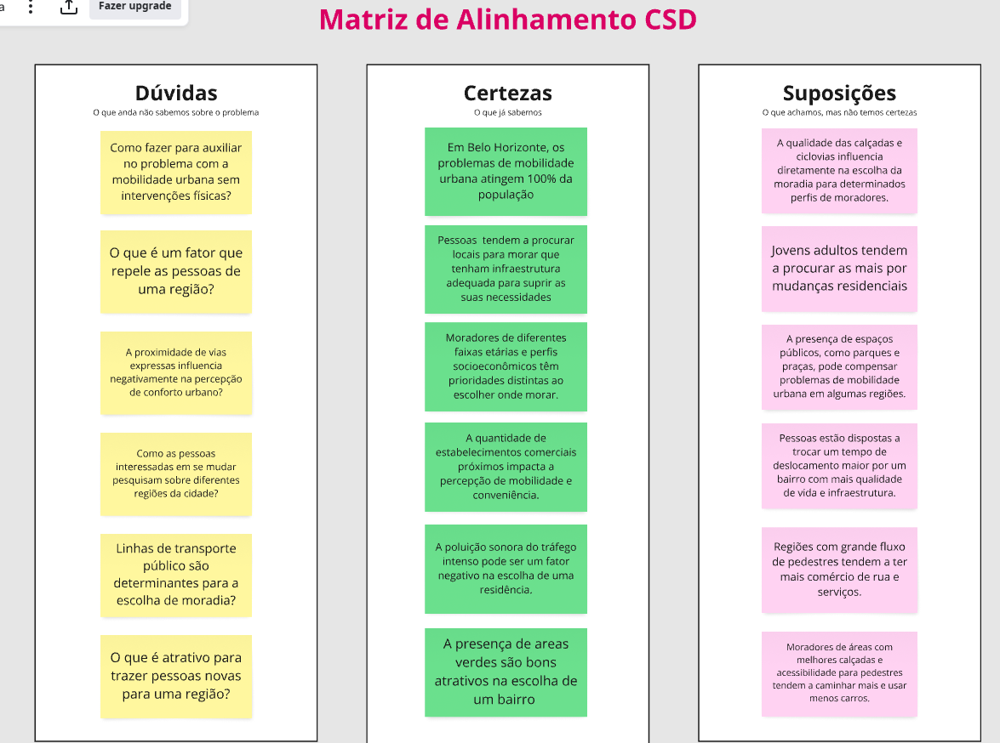
* **Mapa de stakeholders**: 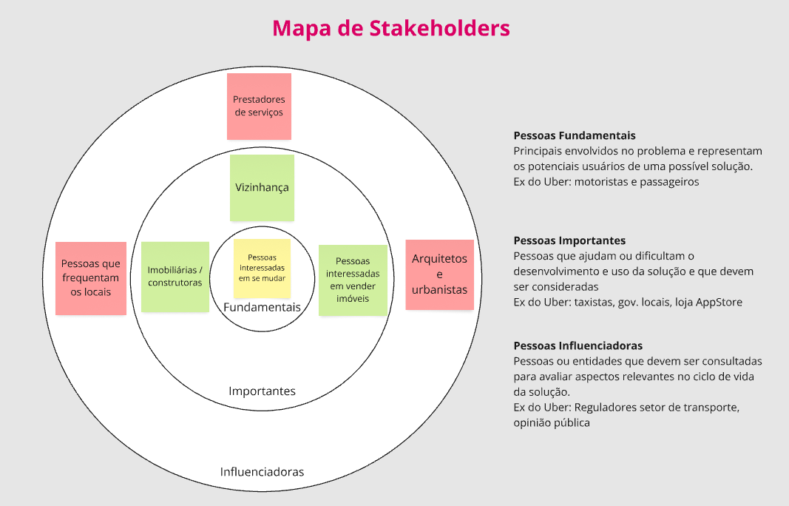
* **Entrevistas qualitativas**: 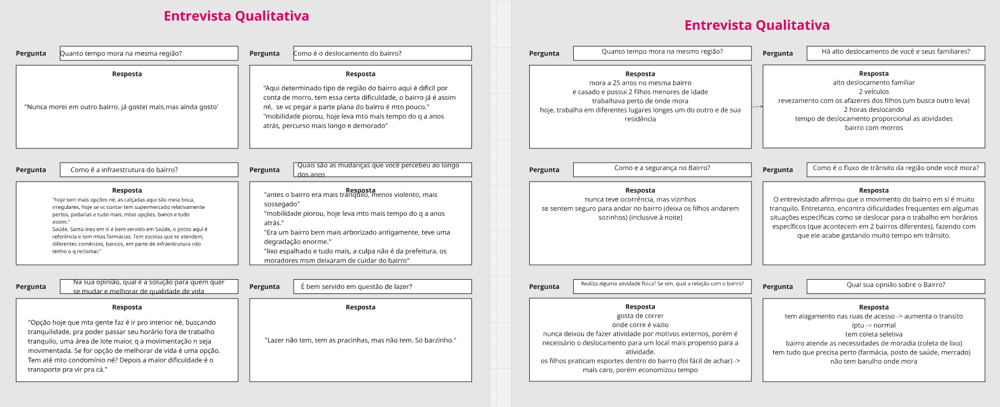
* **Highlights de pesquisa**: 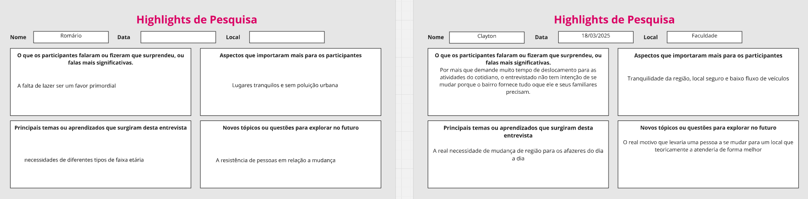

## Etapa de Definição

### Personas

### Persona 1 – Clayton

**Idade**: 48 anos

**Profissão**: Professor

**Hobby**: Corrida

**Personalidade**: Sereno, compreensivo e paciente

**Sonhos**: Ter uma vida tranquila e ver os filhos terem sucesso


**Objetos e Lugares**:
Clayton utiliza frequentemente dispositivos digitais como smartphones e notebooks, especialmente para fins educacionais e organização pessoal. Ele costuma acessá-los em casa e na escola, principalmente pela manhã e à noite, quando está planejando aulas ou lendo notícias.

**Objetivos Chave**:
Busca segurança e organização em seu dia a dia. Ele valoriza soluções que otimizem seu tempo e tragam praticidade à rotina. Deseja garantir sua própria segurança e a da família, principalmente ao se locomover a pé ou de carro em ambientes urbanos.

**Como devemos tratá-lo**:
Clayton valoriza clareza, educação e respeito. Gosta de ser tratado com empatia e paciência, especialmente em serviços que envolvam tecnologia. Atendimentos simples, sem burocracia e que transmitam confiança deixam-no mais satisfeito.

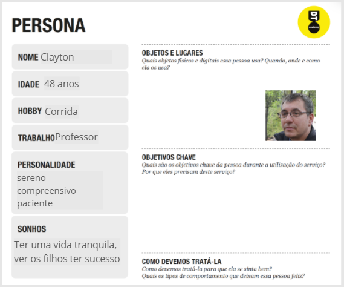

### Persona 2 - Romário

**Idade**: 61 anos

**Profissão**: Técnico de Telecomunicações

**Hobby**: Atleta (possivelmente corrida ou caminhada)

**Personalidade**: Tranquilo

**Sonhos**: Ter uma vida estável, feliz e realizada, com sucesso pessoal e profissional, aproveitando momentos especiais com quem ama.


**Objetos e Lugares**:
Romário costuma utilizar aparelhos como celular e relógio esportivo para acompanhar suas atividades físicas e se manter informado. Ele utiliza esses dispositivos tanto em casa quanto durante passeios ao ar livre. A tecnologia faz parte da sua rotina, mas ele prefere soluções simples e intuitivas.

**Objetivos Chave**:
Busca conforto, segurança e qualidade de vida. Quer ferramentas que o ajudem a manter-se ativo com autonomia e segurança, principalmente em ambientes públicos, como ruas e praças. Tem preocupação com a acessibilidade urbana, especialmente em cruzamentos e semáforos.

**Como devemos tratá-lo**:
Romário aprecia uma abordagem respeitosa, com explicações claras e paciência. Gosta de sentir que está no controle e que pode confiar no serviço oferecido. Ele se sente feliz quando percebe que suas necessidades foram consideradas no desenvolvimento da solução.

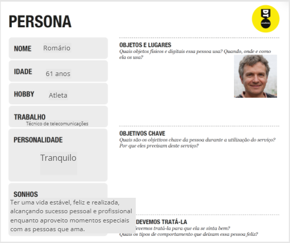

# Product Design

Nesse momento, vamos transformar os insights e validações obtidos em soluções tangíveis e utilizáveis. Essa fase envolve a definição de uma proposta de valor, detalhando a prioridade de cada ideia e a consequente criação de wireframes, mockups e protótipos de alta fidelidade, que detalham a interface e a experiência do usuário.

## Histórias de Usuários

Com base na análise das personas foram identificadas as seguintes histórias de usuários:

| EU COMO...`PERSONA` | QUERO/PRECISO ...`FUNCIONALIDADE`        | PARA ...`MOTIVO/VALOR`               |
| --------------------- | ------------------------------------------ | -------------------------------------- |
| Pessoa interessada em se mudar   | Mais informações sobre outros locais | Buscar locais que vão suprir minhas necessidades |
| Estudante/Parente de estudante         | Boa logísitica sobre mobiliade urbana      | Otimizar o tempo de deslocamento |
| Idosos | Lugares que promovam lazer e garantam uma boa mobilidade | Melhorar a qualidade de vida |
| Micro-empreendedor | Comprar e vender imóveis | Lucrar |
| Dono de construtora | Áreas com alto potencial construtivo | Desenvolver meu negócio |

## Proposta de Valor

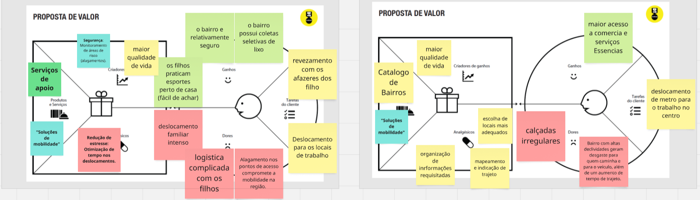

## Requisitos

As tabelas que se seguem apresentam os requisitos funcionais e não funcionais que detalham o escopo do projeto.

### Requisitos Funcionais

.png)

### Requisitos não Funcionais

.png)

## Projeto de Interface

Artefatos relacionados com a interface e a interacão do usuário na proposta de solução.

### Wireframes

#### Home page
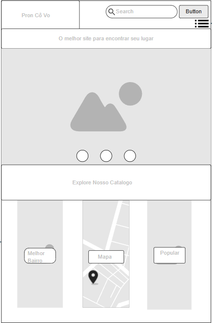
#### Página secundária
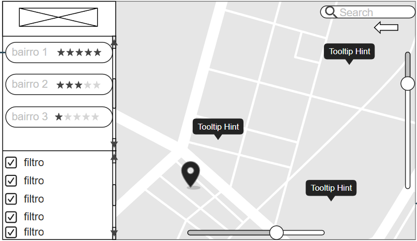
#### Página terciária
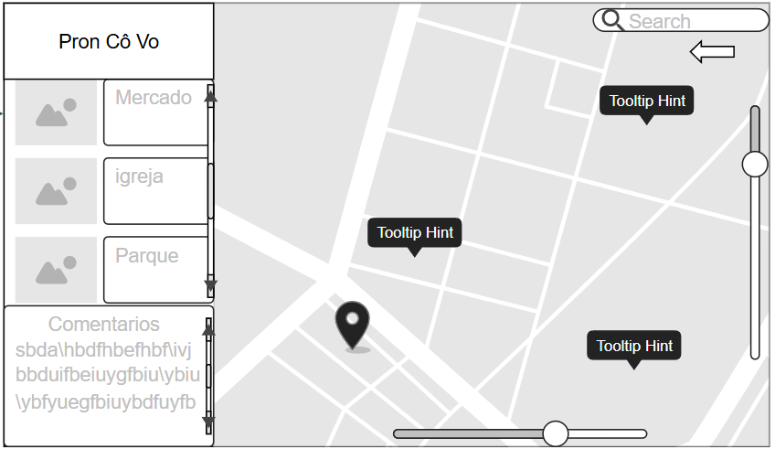
#### Página de configuração

#### Página de login
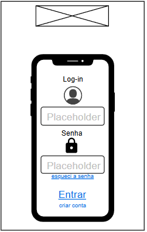
#### Página de acesso
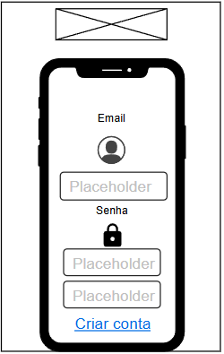
#### User Flow
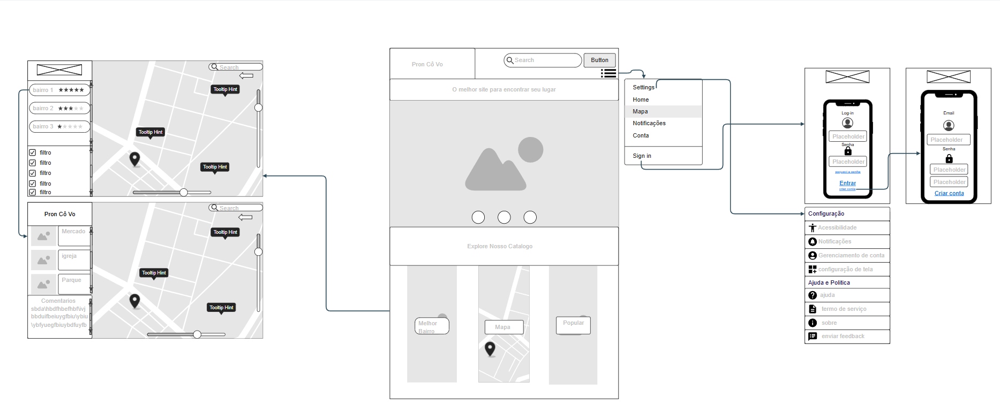

### Protótipo Interativo

✅ [Protótipo Interativo (Mocups)](https://app.moqups.com/97u0viRwIZzCBf1PWQpyA5GSZOaoOw5J/view/page/ae4a90dd1)

# Metodologia

Para o desenvolvimento deste projeto, utilizamos uma abordagem prática baseada em pesquisa, planejamento e desenvolvimento web.

Inicialmente, realizamos uma pesquisa exploratória para entender os principais desafios relacionados à mobilidade urbana, com base em fontes confiáveis da internet e artigos acadêmicos.

Em seguida, utilizamos a metodologia Kanban para organizar as tarefas da equipe, dividindo o projeto em etapas: A Fazer, Fazendo e Feito. Essa abordagem permitiu um acompanhamento visual do progresso e facilitou a colaboração entre os membros do grupo.

O desenvolvimento do projeto foi feito utilizando HTML, CSS e JavaScript, com foco em construir uma interface web responsiva e informativa. Para o controle de versão do código, utilizamos a ferramenta Git, com repositório hospedado no GitHub, garantindo organização e rastreabilidade das alterações feitas ao longo do tempo.

Todo o projeto foi estruturado para ser apresentado de forma clara e acessível, com foco na experiência do usuário e na relevância social do tema.

## Ferramentas

Relação de ferramentas empregadas pelo grupo durante o projeto.

| Ambiente                    | Plataforma | Link de acesso                                     |
| --------------------------- | ---------- | -------------------------------------------------- |
| Processo de Design Thinking | Miro       | https://miro.com/app/board/uXjVISPOtao=/?share_link_id=297511094984        |
| Repositório de código       | GitHub     | https://github.com/ICEI-PUC-Minas-PPLCC-TI/atividade-01-grupo-09-mobilidade-urbana-01.git      |
| Hospedagem do site          | Render     | https://site.render.com/XXXXXXX ⚠️ EXEMPLO ⚠️ |
| Protótipo Interativo        | Mocup      | https://app.moqups.com/97u0viRwIZzCBf1PWQpyA5GSZOaoOw5J/view/page/ad64222d5  |
|                             |            |                                                    |

## Gerenciamento do Projeto


# Solução Implementada

Esta seção apresenta todos os detalhes da solução criada no projeto.

## Vídeo do Projeto

O vídeo a seguir traz uma apresentação do problema que a equipe está tratando e a proposta de solução.

[](https://www.youtube.com/watch?v=tYqC0QxtNME)

## Funcionalidades

Esta seção apresenta as funcionalidades da solução.Info

## Funcionalidade 1 - Apresentação de Equipamentos Públicos

Permite a apresentação de equipamnetos públicos no bairro selecionado

* **Estrutura de dados:** [equipamentoPublicos](#ti_ed_contatos)
* **Instruções de acesso:**
  * Abra a seleção de bairros
  * Selecione o bairro e o equipamento que busca
  * Caso tenha disponível, a funcionalidade o apresentará
* **Tela da funcionalidade**:
 


### Estrutura de Dados - Equipamentos Publicos

Contatos da aplicação

```json
  "equipamentosPublicos": 
    {
      "id": "1",
      "properties": {
        "name": "Biblioteca Pública Estadual de Minas Gerais",
        "description": "Acesso à leitura e informação.",
        "category": "biblioteca",
        "address": "Praça da Liberdade, 21 - Funcionários",
        "bairro": "Funcionários",
        "latitude": -19.9321,
        "longitude": -43.9375,
        "status": "aprovado"
      }
    },
  
```

## Funcionalidade 2 - Apresentação de Serviços por bairro

Permite a apresentação de serviços disponíveis no bairro selecionado

* **Estrutura de dados:** [equipamentoPublicos](#ti_ed_contatos)
* **Instruções de acesso:**
  * Abra a seleção de bairros
  * Selecione o bairro e o equipamento que busca
  * Caso tenha disponível, a funcionalidade o apresentará
* **Tela da funcionalidade**:
 


### Estrutura de Dados - Equipamentos Publicos

Contatos da aplicação

```json
  "id": "36",
      "properties": {
        "name": "Drogaria Araújo",
        "description": "Telefone: (31) 3245-6789",
        "category": "farmacia",
        "address": "Av. do Contorno, 6061",
        "bairro": "Savassi",
        "latitude": -19.9348,
        "longitude": -43.9395
      }
  
```

## Funcionalidade 3 - Sistema de avaliação

Permite o usuário avaliar o bairro selecionado

* **Estrutura de dados:** [respostas](#ti_ed_contatos)
* **Instruções de acesso:**
  * Abra a seleção de bairros
  * Selecione a opção avaliar bairro
  * Será aberto uma página para a avaliação com estrelas
* **Tela da funcionalidade**:
 


### Estrutura de Dados - Equipamentos Publicos

Contatos da aplicação

```json
  "respostas": 
    {
      "id": "0ab2",
      "bairro": "Padre Eustaquio",
      "seguranca": 4,
      "escolas": 2,
      "saude": 5,
      "mobilidade": 3,
      "transporte": 3,
      "limpeza": 5,
      "iluminacao": 3,
      "lazer": 4,
      "data": "2025-06-17T20:47:43.113Z"
    },
  
```

## Funcionalidade 4 - Sistema de apresentação dos Bairros

Permite a apresentação de bairros para o usuário

* **Estrutura de dados:** [banco-dados-bairro](#ti_ed_contatos)
* **Instruções de acesso:**
  * Abra a seleção de bairros
  * Selecione o bairro desejado
  * Selecione avaliar bairro
* **Tela da funcionalidade**:
 


### Estrutura de Dados - Equipamentos Publicos

Contatos da aplicação

```json
   "banco-dados-bairros": 
    {
      "id": "1",
      "nome": "Primeiro de Maio",
      "regional": "Norte",
      "populacao-aproximada": "10.000",
      "observacao": "Considerado uma referência cultural na região"
    },
  
```

## Funcionalidade 5 - Apresentação de transporte públicos

Permite a apresentação de transportes públicos

* **Estrutura de dados:** [equipamentoPublico](#ti_ed_contatos)
* **Instruções de acesso:**
  * Abra a seleção de bairro
  * Selecione o bairro desejado
  * Será apresentado os transportes públicos da região
* **Tela da funcionalidade**:
 

![image]

### Estrutura de Dados - Equipamentos Publicos

Contatos da aplicação

```json
   {
      "id": "42",
      "properties": {
        "name": "Hotel Boulevard",
        "description": "Telefone: (31) 3241-9999",
        "category": "hotel",
        "address": "Rua dos Tamoios, 341",
        "bairro": "Centro",
        "latitude": -19.9213,
        "longitude": -43.9405
      }
    }
```


## Funcionalidade 6 - CRUD equipamento publico

Permite a criação, edição e remoção de equiámento publico

* **Estrutura de dados:** [equipamentoPublico](#ti_ed_contatos)
* **Instruções de acesso:**
  * Abra a seleção de bairros
  * Selecione o bairro desejado
  * Será aberto uma página para a avaliação com estrelas
* **Tela da funcionalidade**:
 


### Estrutura de Dados - Equipamentos Publicos

Contatos da aplicação

```json
   {
      "id": "42",
      "properties": {
        "name": "Hotel Boulevard",
        "description": "Telefone: (31) 3241-9999",
        "category": "hotel",
        "address": "Rua dos Tamoios, 341",
        "bairro": "Centro",
        "latitude": -19.9213,
        "longitude": -43.9405
      }
    }
```

## Funcionalidade 7 - CRUD serviços por bairro

Permite a criação, edição e remoção de equiámento publico

* **Estrutura de dados:** [equipamentoPublico](#ti_ed_contatos)
* **Instruções de acesso:**
  * Abra a seleção de bairros
  * Selecione o bairro desejado
  * Será aberto uma página para a avaliação com estrelas
* **Tela da funcionalidade**:
 


### Estrutura de Dados - Equipamentos Publicos

Contatos da aplicação

```json
   {
      "id": "38",
      "properties": {
        "name": "Restaurante Xapuri",
        "description": "Telefone: (31) 3287-1234",
        "category": "restaurante",
        "address": "Rua Mandacaru, 260",
        "bairro": "Pampulha",
        "latitude": -19.8622,
        "longitude": -44.0069
      }
    },
```

## Funcionalidade 8 - Seção de comentários

Permite a criação, edição e remoção de equiámento publico

* **Estrutura de dados:** [comentarios](#ti_ed_contatos)
* **Instruções de acesso:**
  * Abra a seleção de bairros
  * Selecione deixar comentário
  * Será aberto uma página para comentários
* **Tela da funcionalidade**:
 


### Estrutura de Dados - Equipamentos Publicos

Contatos da aplicação

```json
  {
      "id": "1885",
      "bairro": "Primeiro de Maio",
      "comentario": "test",
      "anonimo": true,
      "data": "2025-06-17T21:59:09.483Z",
      "nome": "Anônimo"
    },
```

## Funcionalidade 9 - Carrossel de eventos

Permite a criação, edição e remoção de equiámento publico

* **Estrutura de dados:** [eventos](#ti_ed_contatos)
* **Instruções de acesso:**
  * Abra a seleção de bairros
  * Selecione o bairro desejado
  * Será aberto uma página para a avaliação com estrelas
* **Tela da funcionalidade**:

 


### Estrutura de Dados - Equipamentos Publicos

Contatos da aplicação

```json
   "eventos": 
    {
      "id": "1",
      "title": "Expo RH Indaiatuba 2025",
      "subtitle": "O MAIOR evento de gestão de pessoas do interior paulista!",
      "date": "17/10/2025",
      "image": "./assets/images/eventos/expo-rh.png"
    },
```

## Módulos e APIs

Esta seção apresenta os módulos e APIs utilizados na solução

**API**:

* Mapbox - [https://api.mapbox.com/styles/v1/{id}/tiles/{z}/{x}/{y}?access_token={accessToken}']

**Scripts:**

* Bootstrap 4 - [https://cdn.jsdelivr.net/npm/bootstrap@5.3.2/dist/css/bootstrap.min.css]

# Referências

As referências utilizadas no trabalho foram:

QUINTOANDAR. Tudo sobre o Bairro Santo Agostinho. São Paulo: QuintoAndar, 2023.
GOOGLE MAPS. Belo Horizonte. Mountain View (CA, EUA): Google, 2025.
